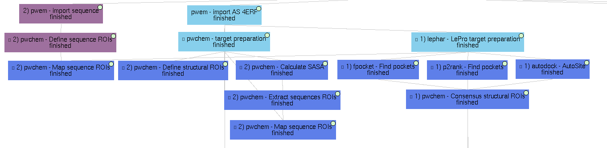
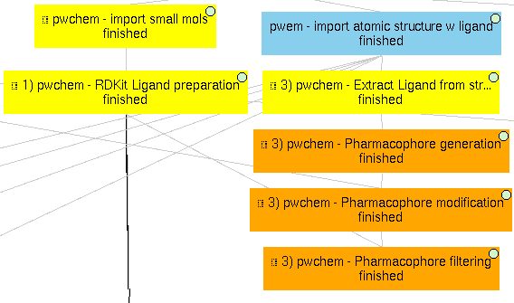

================================
Scipion-chem Paper Data
================================

This repository contains all the data discussed in the Scipion-chem paper. These are:

Virtual Drug Screening workflow example (4erf_workflow)
-----------------------------------------------------------

Example shown in "Virtual Drug Screening workflow" section for 4ERF PDB structure. Contains the Scipion project
folder, which can be imported into the Scipion workflow engine and reproduced once all the necessary plugins are
installed.
The example can be divided into 4 subworkflows, which are examples of useful tasks discussed in the paper. The protocols
related to each of these subworkflows can be identified by their labels in the GUI, which have the form:

<Subworkflow number> ) <Plugin> - <Task performed>

Images are added in this document to localize the subworkflows, but note that the protocols might appear disordered.

These subworkflows are:

1) Main VDS workflow
~~~~~~~~~~~~~~~~~~~~~

Principal workflow that includes protocols following the "Virtual Drug Screening workflow" section:

.. figure:: images/subworkflow1_4erf.png
   :alt: vds workflow 4erf

1) **Molecules import**
    - **Receptor import**: 4ERF structure from PDB web, a ligase from Homo Sapiens
    - **Small molecules import**: 4 ZINC small molecule structures are imported from local "mol2" files
      (included in this repository).

2) **Molecules preparation**
    - **Receptor preparation**: we used LePro protein preparation (from LePhar) to prepare the receptor, removing
      the ligand included in the structure and other heteroatoms and extracting only chain A.
    - **Small molecules preparation**: we used OpenBabel ligand preparation in order to add charges to the imported
      small molecules and generating up to 2 conformers for each of them.

3) **Molecules filtering**
    - **Regions Of Interest definition**: set of protocols that tries to find the most promising regions of the
      receptor for interacting with the ligand. We did so by, first, independently predicting these receptor
      pockets with FPocket, P2Rank and AutoSite. Then, the results of each software are combined using the
      consensus protocol as explained in the paper.

4) **Docking**

   Prepared small molecules are docked onto the consensus ROIs. This task is performed independently using
   LeDock, AutoDock-GPU and Vina, with default parameters. Then, as explained in the paper, the results of
   these protocols are rescored using ODDT Vina and RFScore_v3. Finally, the rescored docking poses are
   combined and the most promising ones are extracted using the consensus protocol.

5) **Molecular dynamics**

   The best scored docking pose from the consensus docking protocol (ZINC1453, according to the ODDT Vina score)
   is used as input for the Molecular dynamics simulation example. To do so, we used Desmond, from Schrödinger.
   We used this commercial software because of the advanced trajectory analysis and the automatic ligand
   parametrization they provide.

   - System preparation: the docked molecule (together with the receptor) is surrounded by a water box
     (with 5A buffer) with the SPC water model. Na+ and Cl- are added to reach 0.15M concentration and
     neutralizing the system. S-OPLS main force field is used to parametrize the system.
   - Simulation: the prepared system is simulated in this protocol using Desmond. First, the system is
     minimized and equilibrated following the default Desmond procedure. Then, a small production simulation
     is executed, enlarging the trajectory with 24ps of unrestricted simulations.
   - Production simulation: a second simulation protocol is executed to generate a larger production simulation
     of 5000ps of unrestricted simulation at native conditions, generating a trajectory that could be analyzed.

|
2) Structural ROIs definition
~~~~~~~~~~~~~~~~~~~~~~~~~~~~~~
This Scipion project also includes several examples on how to determine the structural ROIs discussed in the paper.

1) **Manual definition**

    We show a manual structural ROI definition in the 4ERF-A structure based on the area of its own ligand.

2) **Mapping from sequence ROIs**

    Similarly to structural ROIs, Scipion-chem includes several ways to define Regions Of Interest over sequences. In this
    example, we manually define two sequence ROIs on residues 1-4 and 22-25, which are then mapped to the structure in
    order to define structural ROIs.

3) **Based on target characteristics**

    As explained in the paper, another option to define structural ROIs is based on target characteristics. In this
    example, the SASA (Solvent-Accessible Surface Area) is calculated over the 4ERF-A structure. From it, a protocol
    extract the sequence ROIs containing higher values of SASA, and these are mapped to structural ROIs.

4) **Predicted pockets**

    From the previous subworkflow, we have already shown an example of how structural ROIs can be defined using programs
    that predict these protein concavities we call pockets.

|
3) Pharmacophore-based workflow
~~~~~~~~~~~~~~~~~~~~~~~~~~~~~~~
As described in the paper, Scipion-chem includes some features to perform pharmacophore-based virtual screening. In this
project, an example is shown.

.. figure:: images/subworkflow3_4erf.png
   :alt: pharmacophore workflow 4erf

To do so, the actual ligand of 4ERF is first extracted and a pharmacophore is generated from it. This resulting
pharmacophore is slightly modified to be more flexible using another Scipion-chem protocol, and this modified
pharmacophore is finally used as a filter for out set of 4 small molecules. In this example, as the pharmacophore
features are built using RDKit, we prepared the small molecules using RDKit too. The position of ZINC1099, fitted into
the pharmacophore, is shown in the figure of the paper related to this section.

We prepared the molecules using RDKit because, unfortunately, the full
interoperability is not yet achieved in Scipion-chem, and this is an example of it. Sometimes, small molecules
prepared with OpenBabel would not be parsed properly with RDKit and the protocols would fail.

|
4) Molecular dynamics (MD)
~~~~~~~~~~~~~~~~~~~~~~~~~~~~~~~
Finally, this demo project also includes several examples of molecular dynamics simulations.

.. figure:: images/subworkflow4_4erf.png
   :alt: md workflow 4erf

1) **On a docked molecule**

    As described in the "Main VDS workflow" section, a molecular dynamics simulation is
    performed using Desmond over the most promising docked molecule.

2) **On the original complex**

    The project includes an example the performs a MD simulation on the actual ligand of
    4ERF (OR3) together with its receptor. This simulation is again performed on Desmond, since MD simulations with ligands
    are not yet supported in gromacs or amber (they will hopefully come soon).

3) **Only on the receptor**

    Finally, a MD simulation is performed on the receptor only, this time using Gromacs. As for
    the previous cases, a first protocol is used to define the system, with the water box, ions and force fields; and a
    second protocol actually executes the simulation, which can be visualized using PyMol or VMD (recommended). Moreover,
    several Gromacs trajectory analysis can be executed from the Scipion GUI in the Analyze results option.

    Note that the receptor file used for this subworkflow comes from a local file (4erf_prepared.pdb, included in this
    repository). This file was obtained using PDBFixer, a software from OpenMM, using scipion-chem-scipionOpenmm, a plugin
    not yet released. We use this because Gromacs needs a deep preparation of the input receptor in order to run.

|
|
|

Show case (1a28_workflow)
-----------------------------------------------------------
Similar workflows can be found in 1a28_workflow, with a few variations described in section "Show case" of the paper.
The same pattern ( <Subworkflow number> ) <Plugin> - <Task performed> ) is used to describe identify the subworkflow
each of the protocols belongs to. In this case, the subworkflows are:

1) Main VDS workflow
~~~~~~~~~~~~~~~~~~~~~
Principal workflow that includes protocols following the "Show case" section:

.. figure:: images/subworkflow1_1a28.png
   :alt: vds workflow 1a28

1) **Molecules import**
    - **Receptor import**: 1A28 structure from dcoid dataset, corresponding to 1A28 PDB entry, the progesterone receptor
      linked to its ligand progesterone. The ligand is removed from the original structure in order to get the receptor
      structure.
    - **Small molecules import**: the 4 small molecule provided in the dcoid dataset are imported from local files.
      These include the active molecule (progesterone) and 3 decoys which have been proved not to interact with the
      receptor.

2) **Molecules preparation**
    - **Receptor preparation**: we used Scipion-chem protocol (using biopython) to prepare the receptor, removing
      water and other heteroatoms.
    - **Small molecules preparation**: we used OpenBabel ligand preparation in order to add charges to the imported
      small molecules and generating up to 5 conformers for each of them.

3) **Molecules filtering**
    - **Ligand filtering**: RDKit ADME and PAINS filter protocols are executed over the input molecules (previously
      prepared with RDKit). The 4 of them pass the filters.

    - **Regions Of Interest definition**: set of protocols that tries to find the most promising regions of the
      receptor for interacting with the ligand. We did so by, first, independently predicting these receptor
      pockets with FPocket, P2Rank and AutoSite. Then, the results of each software are combined using the
      consensus protocol as explained in the paper. These resulting ROIs contain both the actual pocket of the
      progesterone and the same pocket in the dimer, which is not occupied in the actual structure, as shown in the
      figure in the paper related to this section.

4) **Docking**

   Prepared small molecules are docked onto the consensus ROIs. This task is performed independently using
   LeDock, AutoDock-GPU and Vina, with default parameters. Then, as explained in the paper, the results of
   these protocols are rescored using ODDT Vina, RFScore_v3 and NNScore. Finally, the rescored docking poses are
   combined and the most promising ones are extracted using the consensus protocol, with the different parameters
   explained in the paper. The name of the protocol specifies the parameters as: asking the clusters to contain x
   out of y input source poses (clut x/y) and with intra-cluster maximum RMSD of z (Rz).
   An additional protocol is added in this workflow to measure the RMSD distance of each of the docking poses to the
   actual ligand position.

5) **Molecular dynamics**

   The best 2 scored docking pose from the consensus docking protocol (which are the actual ligand, progesterone,
   according to all the tried scores) are used as input for the Molecular dynamics simulation example.
   Each of them come from a different pocket, but have similar scores, are stated in the paper.
   To do so, we used Desmond, from Schrödinger. We used this commercial software because of the advanced trajectory
   analysis and the automatic ligand parametrization they provide.

   - System preparation: the docked molecule (together with the receptor) is surrounded by a water box
     (with 5A buffer) with the SPC water model. Na+ and Cl- are added to reach 0.15M concentration and
     neutralizing the system. S-OPLS main force field is used to parametrize the system.
   - Simulation: the prepared system is simulated in this protocol using Desmond. First, the system is
     minimized and equilibrated following the default Desmond procedure. Then, a small production simulation
     is executed, enlarging the trajectory with 24ps of unrestricted simulations.

|
2) Structural ROIs definition
~~~~~~~~~~~~~~~~~~~~~~~~~~~~~~
This Scipion project also includes one example on how to determine structural ROIs based on mutations or variants
of the original receptor sequence and known binding residues.

|
3) Pharmacophore-based workflow
~~~~~~~~~~~~~~~~~~~~~~~~~~~~~~~
This project includes the pharmacophore-based screening described in the paper.

To do so, the actual ligand of 1A28 is first extracted and a pharmacophore is generated from it. This pharmacophore
is used as a filter for out set of 4 small molecules. In this example, as the pharmacophore
features are built using RDKit, we prepared the small molecules using RDKit too. The only small molecule fitted into
the pharmacophore is the actual ligand, the progesterone, shown in the figure of the paper related to this section.

|
4) Molecular dynamics (MD)
~~~~~~~~~~~~~~~~~~~~~~~~~~~~~~~
Finally, this project also includes several examples of molecular dynamics simulations.

1) **On a docked molecule**

    As described in the "Main VDS workflow" section, two molecular dynamics simulation are
    performed using Desmond over the most promising docked molecules.

2) **Only on the receptor**

    Finally, a MD simulation is performed on the receptor only, this time using Gromacs. As for
    the previous cases, a first protocol is used to define the system, with the water box, ions and force fields; and a
    second protocol actually executes the simulation, which can be visualized using PyMol or VMD (recommended). Moreover,
    several Gromacs trajectory analysis can be executed from the Scipion GUI in the Analyze results option.
    However, the simulation is not executed in the project, since the resulting trajectory is composed by large files
    that could not be uploaded on GitHub, but the user is free to execute it locally.

|
|
|

Software availability
-----------------------------------------------------------
All the commented Scipion-chem plugins are built on the Scipion workflow engine, which can be found in
https://scipion.i2pc.es/ .

As stated in the paper, `Scipion-chem <https://github.com/scipion-chem>`_ integrates a set of bioinformatic tools and
software inside the platform.
Most of this tools are open, and no license is required for their use, so Scipion-chem installs it automatically,
taking care of properly referencing all the sources.

In the case of the few licensed software, the user must install
either the programs or the license by themselves and tell Scipion-chem where the software is installed. More detailed
guides on how to proceed with the installations can be found in the repositories of each of the plugins.

A complete list of these software, organized by the plugins they are installed on, is described below. The versions
refer to the moment this document is being written, but updates are constantly being made.

1) `Scipion-chem: <https://github.com/scipion-chem/scipion-chem>`_ as the core plugin, it installs a wide set of tools.

    - OpenBabel 2.2 (conda)
    - RDKit 2021.09.4 (conda)
    - MGLTools 1.5.7 (https://ccsb.scripps.edu)
    - Shape-it 2.0.0 (https://github.com/rdkit/shape-it.git)
    - JChemPaint 3.2.0 (https://sourceforge.net/projects/cdk/files/JChemPaint)
    - PyMol 2.5.5 (https://pymol.org/installers)
    - AliView 1.28 (https://ormbunkar.se/aliview)
    - VMD 1.9.3 (conda)
    - MDTraj 1.9.8 (conda)

2) `Scipion-chem-amber: <https://github.com/scipion-chem/scipion-chem-amber>`_

    - AmberTools 21 (conda)

3) `Scipion-chem-autodock: <https://github.com/scipion-chem/scipion-chem-autodock>`_

    - AutoDockSuite 4.2.6 (https://autodock.scripps.edu)
    - AutoDock-GPU (https://github.com/ccsb-scripps/AutoDock-GPU.git)
    - Vina 1.2.3 (https://github.com/ccsb-scripps/AutoDock-Vina.git)
    - ADFRSuite 1.0 (https://ccsb.scripps.edu/adfr)
    - Meeko (pip)

4) `Scipion-chem-blast: <https://github.com/scipion-chem/scipion-chem-blast>`_

    - BLAST+ 2.12.0 (https://ftp.ncbi.nlm.nih.gov/blast)

5)  `Scipion-chem-fpocket: <https://github.com/scipion-chem/scipion-chem-fpocket>`_

    - FPocket 3.0 (conda)

6) `Scipion-chem-gromacs: <https://github.com/scipion-chem/scipion-chem-gromacs>`_

    - Gromacs 2021.5 (https://ftp.gromacs.org/gromacs)

7) `Scipion-chem-lephar: <https://github.com/scipion-chem/scipion-chem-lephar>`_

    - LeDock - (http://www.lephar.com)
    - LePro - (http://www.lephar.com)

8) `Scipion-chem-modeller: <https://github.com/scipion-chem/scipion-chem-modeller>`_

    - Modeller 10.4 (conda) *License Key needed

9) `Scipion-chem-p2rank: <https://github.com/scipion-chem/scipion-chem-p2rank>`_

    - P2Rank 2.3 (https://github.com/rdk/p2rank)

10) `Scipion-chem-rosetta: <https://github.com/scipion-chem/scipion-chem-rosetta>`_

    - Rosetta 3.12 (-) *Need user installation

11) `Scipion-chem-schrodingerScipion: <https://github.com/scipion-chem/scipion-chem-schrodingerScipion>`_

    - Schrödinger Suite 2021-3 (-) *Need user installation and key
